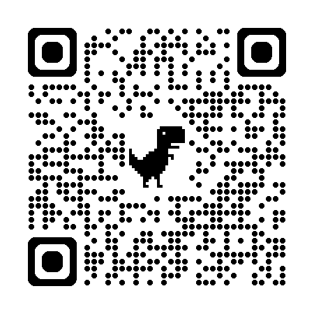

== [.title]#Conclusion#

=== [.sub_title]#@ng-next ?#

[%step]
* Finalisation de la transition Zoneless
* Forms with Signal
* SelectorLess component

=== [.sub_title]#@ng 19#

[%step]
* Incremental hydration
* resources
* linkedSignal

[NOTE.speaker]
--
* Réécriture du compilateur ivy avec template pipeline
* L'équipe d'Angular souhaite encore accélérer sur les évolutions du framework
* sources
** ng18 et hydratation partielle : https://blog.angular.dev/angular-v18-is-now-available-e79d5ac0affe
** selectorless https://x.com/mgechev/status/1773493609461113003, https://dev.to/this-is-angular/episode-2420-angular-talks-at-google-io-jsworld-til-44b7
** https://github.com/angular/angular/blob/19.0.0-rc.1/CHANGELOG.md
--

=== [.sub_title]#Questions ?#

[.conclusion]
****

[.code.github]
--
Github

--

[.code.feedback]
--
Open Feedback

--

****
