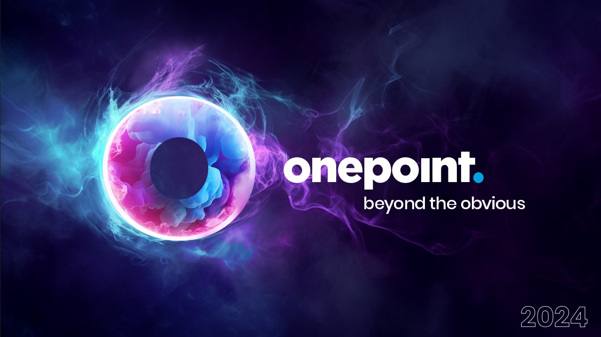
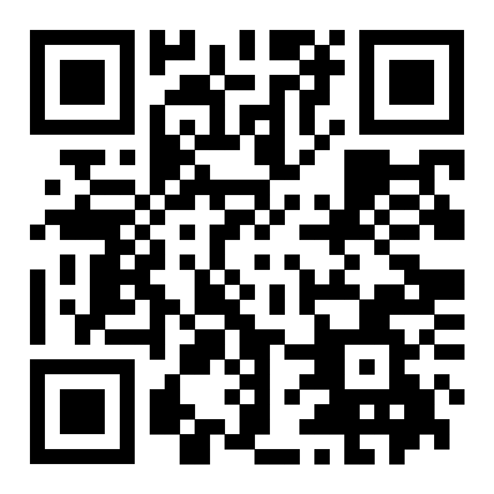

=== [.title]#Angular change de logo, mais pas que!#

image::./images/common/logo_angular_17.png[width=250, align=center]

== !

[.whoami]
****

[.block]
--

- David Maurin
- https://github.com/imryck
- Dev / Architecte
--
****

=== !

[.whoami]
****

[.block]
--

- Florian Allainmat
- https://github.com/fallainmat
- Dev / TechLead

--
****

=== !

[NOTE.speaker]
--
* Présentation de Onepoint très rapide
--

=== !

[NOTE.speaker]
--
* Présentation de l'école Onepoint
* Lien du Qrcode vers la formation Angular Onepoint
--
