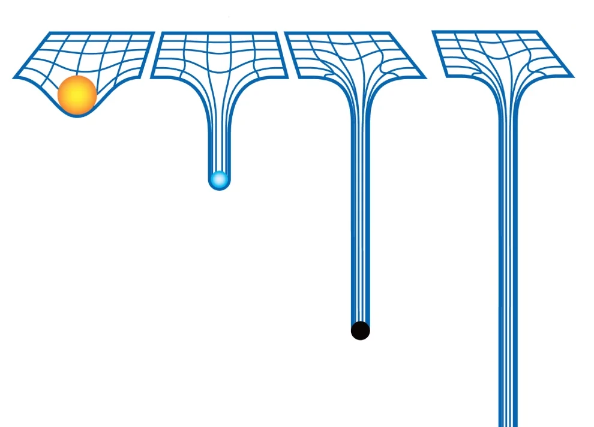

== [.title]#Reporter à plus tard ?#

[.defer-cover]
--
I will render that [.cross-word]#now# [.later-word]#later#
--

[NOTE.speaker]
--
* Timing ~20min
* Nouveau système permettant d'enrichir les systèmes lazy loading déjà présents
* Introduction en v17
--

=== [.sub_title]#Un problème de poids#

[.defer-spa-heavy]
--

[.html]#HTML#
[.htmlcss]#HTML CSS#
[.htmlcssjs]#HTML CSS JS#
[.angular]#Angular#
--

[NOTE.speaker]
--
* Problématique du poids dans les applications JS CSR (afficher l'illustration)
* Expliquer le principe de lazy loading
--

=== [.sub_title]#Le lazy loading dans angular#

[%step.code-example-lg]
--
Lazy loaded routes

[source,typescript]
----
'./feature/feature.module#FeatureModule'

() => import('./feature/feature.module').then(m => m.FeatureModule)
----
--

[%step.code-example-lg]
--
Lazy loaded components

[source,typescript]
----
import('./lazy.component').then((m) => m.LazyComponent)
----
--

[NOTE.speaker]
--
* Le chargement dynamique des routes présent depuis le début qui est passé par un système d'expression avant d'utiliser les import EmacScript
* Expliquer le principe avec l'intégration dans le build et la création de fragments indépendants
* Le chargement dynamique des composants qui est passé par plusieurs phase
** bricolage avec les modules, propriété "lazyModules" qui permettait de définir les fragments avant ivy
** création des fragment basés sur les imports EmacScript à partir d'ivy
--

=== [.sub_title]#Simplification avec @defer#

[source,jsx,highlight="1..14|1,5|2..4|6,8|7|9,11|10|12,14|13"]
----
@defer (when robotList.length > 0) {
  @for (robot of robotList; track robot.name) {
    <app-card class="flex-1" [robot]="robot"/>
  }
}
@placeholder (minimum 200ms) {
  
En attente de participants

}
@error {
  
Erreur lors du chargement des participants

}
@loading (after 200ms; minimum 1s) {
  
Chargement des participants...

}
----

[NOTE.speaker]
--
* Les composant doivent être standalone et non référencé en dehors d'un bloc defer
* La présence du bloc defer permet d'identifier les fragments à créer lors de la construction du livrable
* Placeholder pour afficher un contenu par défaut
* Erreur en cas de problème de chargement du/des fragments
* Loading message de chargement remplaçant le placeholder si présent
--

=== [.sub_title]#triggers#

[%step]
--
[.list]
* when
* on idle
* on interaction
* on hover
* on viewport
* on timer
* on immediate
* prefetch
--

[NOTE.speaker]
--
* Le bloc @defer supporte plusieurs méthodes
* when de gère pas le fait de masquer
* on idle (par défaut)
* interaction (click, keydown)
* on hover (mouseenter, focusin)
* prefetch peut être associé avec un trigger
--
