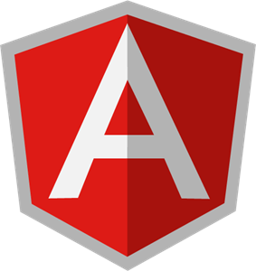
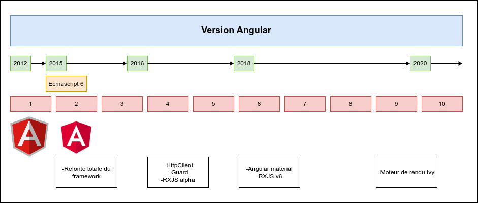
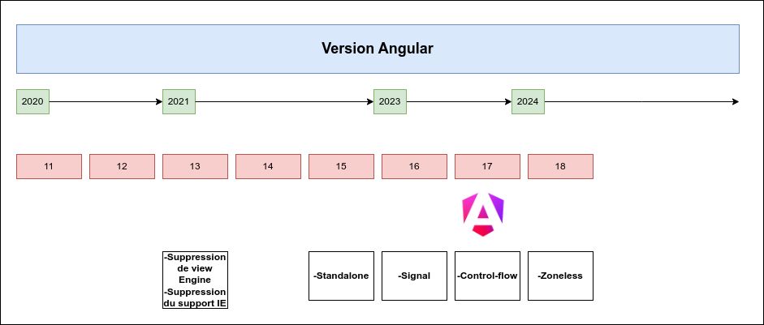
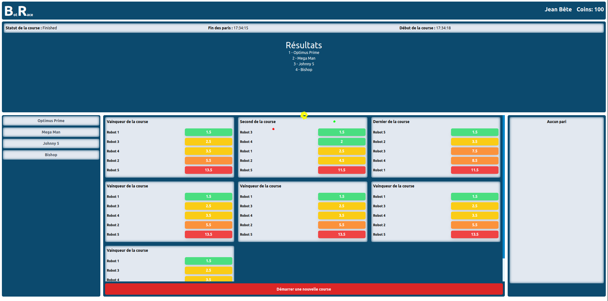
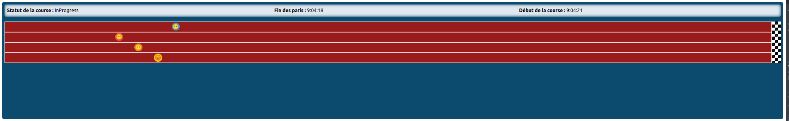
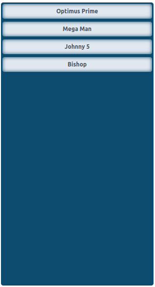
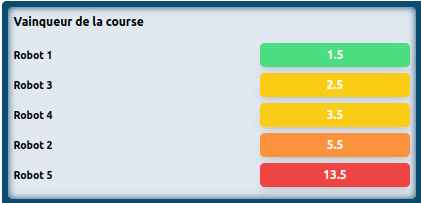
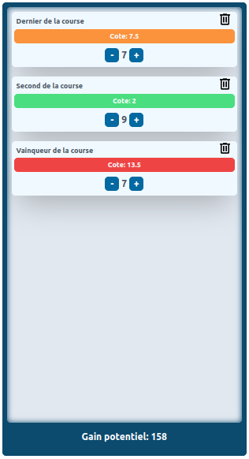

[.columns]
== Quand Angular change de logo

[.column.is-one-third]

[.column.is-one-third]
image::images/logo_angular.png[]
[.column.is-one-third]
image::images/logo_angular_17.png[]

=== Chronologie

=== Chronologie

=== Philosophie du Framework

- **Retrocompatible** : Depuis Angular 2, les versions sont rétrocompatibles
- **Structuré** : Angular impose une structure pour faciliter la maintenance
- **Verbeux** : Angular est verbeux, oups... expressif
- **Modulaire** : Angular est construit autour des modules
- **Performant** : Angular est performant, mais il faut respecter les bonnes pratiques

=== Présentation de RaceBot

=== Race

=== Liste des coureurs

=== Liste des paris possibles

=== Liste des paris effectués

