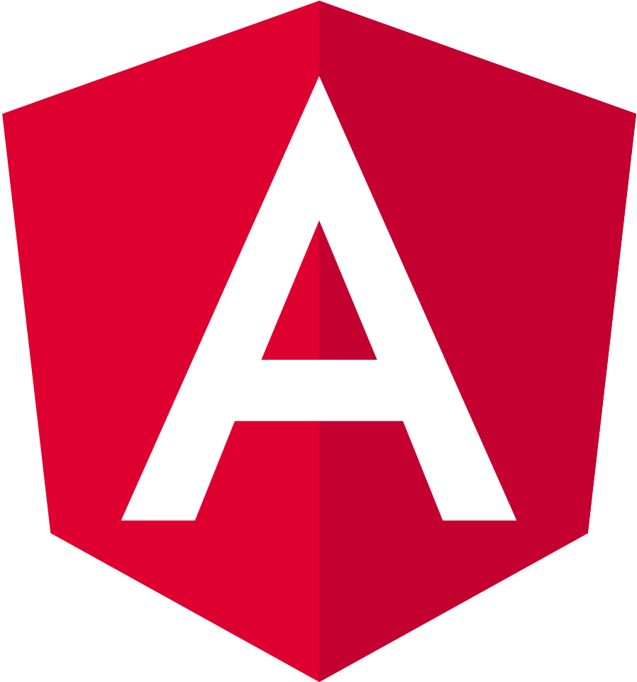
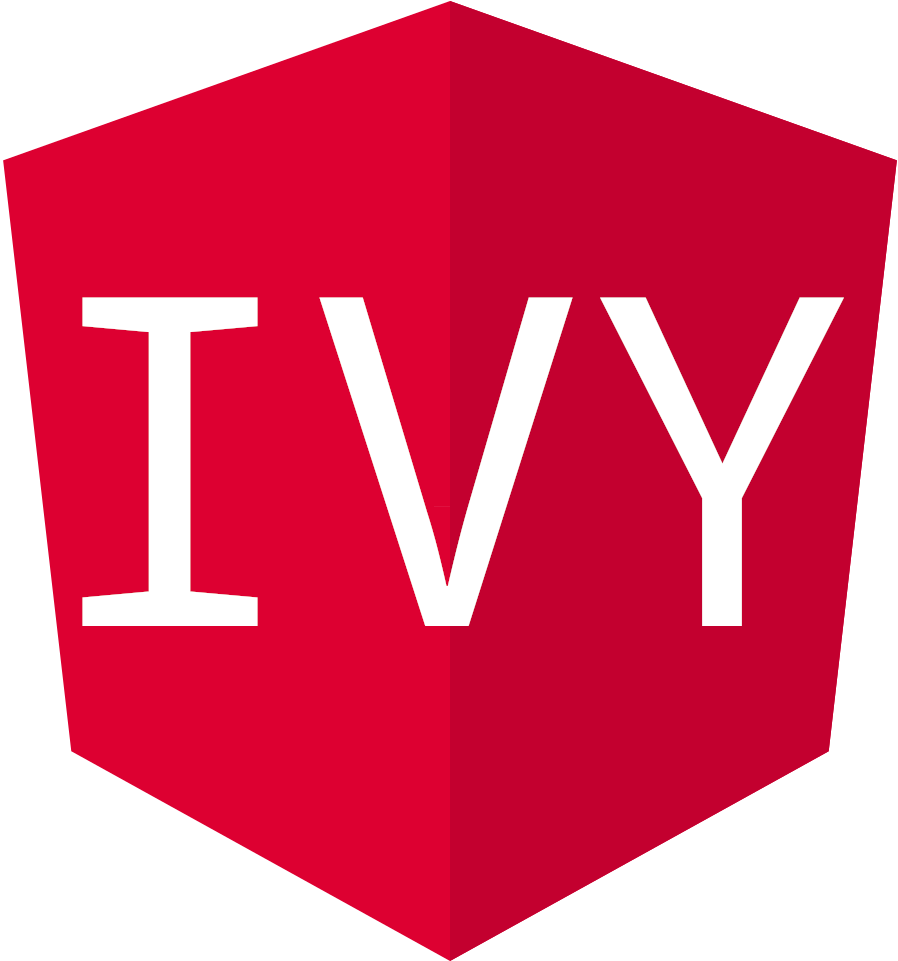

[.columns]

== !

[.column.is-one-third]
image::images/intro/angular/logo_angular_js.png[]
[.column.is-one-third]
image::images/intro/angular/logo_angular.png[]
[.column.is-one-third]
image::images/common/logo_angular_17.png[]

[NOTE.speaker]
--
* Petit laïus sur les logos Onepoint en lien avec le titre de la conférence
--

=== 12 ans...

// image::images/intro/angular/chronologie-angular1.png[]

[.frise]
--

[.frise-background]

--

// ng1
[.frise-step.fade-right%step]
--
[.frise-date.frise-top.frise-item-ng1]
2012

[.frise-item.frise-bottom.frise-item-ng1]
image::./images/intro/angular/logo_angular_js.png[]
--

// ng2
[.frise-step.fade-right%step]
--
[.frise-date.frise-bottom.frise-item-ng2]
2016

[.frise-item.frise-top.frise-item-ng2]

--

// mat
[.frise-step.fade-right%step]
--
[.frise-date.frise-top.frise-item-mat5]
2017

[.frise-item.frise-bottom.frise-item-mat5]
image::./images/intro/angular/material.png[]
[.frise-text.frise-bottom.frise-item-mat5]
ng update +
Material 5 +
PWA
--

// rxjs6
[.frise-step.fade-right%step]
--
[.frise-date.frise-bottom.frise-item-rx6]
2018

[.frise-item.frise-top.frise-item-rx6]
image::./images/intro/angular/logo-rxjs.png[]
[.frise-text.frise-bottom.frise-item-rx6]
RxJs 6 +
Custom Element
--

// ivy
[.frise-step.fade-right%step]
--
[.frise-date.frise-top.frise-item-ivy]
2020

[.frise-item.frise-bottom.frise-item-ivy]

[.frise-text.frise-bottom.frise-item-ivy]
Webpack 5
--

// ng 2022
[.frise-step.fade-right%step]
--
[.frise-date.frise-bottom.frise-item-ng2022]
2022

[.frise-item.frise-top.frise-item-ng2022]

[.frise-text.frise-bottom.frise-item-ng2022]
Standalone +
Typed forms +
Host Directive
--

// ng new
[.frise-step.fade-right%step]
--
[.frise-date.frise-top.frise-item-ngnew]
2023

[.frise-item.frise-bottom.frise-item-ngnew]
image::./images/common/logo_angular_17.png[]
[.frise-text.frise-bottom.frise-item-ngnew]
Signal +
Defer +
Esbuild
ControlFlow
--

[NOTE.speaker]
--
* Présentation des 12 dernières années
* AngularJS un autre framework (petite révolution)
* Mais une autre révolution (React) a forcé à revoir la copie (ng2)
* v3 ? Quelle v3 ?
* Des évolution régulières
* Petit creux entre v9 (2020) et v14 (2022)
* Coup d'accelerateur avec les changements de gouvernance
--

=== Philosophie du Framework

[%step.defer-2-col]
* Retrocompatible
* Complet
* Verbeux
* Modulaire
* Performant

=== Documentation

[%step]
* https://v17.angular.io/docs

* https://angular.dev/

[NOTE.speaker]
--
* Rappel que la documentation est en working progress aussi. Des éléments peuvent être manquants ou incomplets.
--

=== [.title]#Présentation de RaceBot#

[NOTE.speaker]
--
* Présentation de BotRace, un projet de démonstration pour illustrer les concepts d'Angular
--
