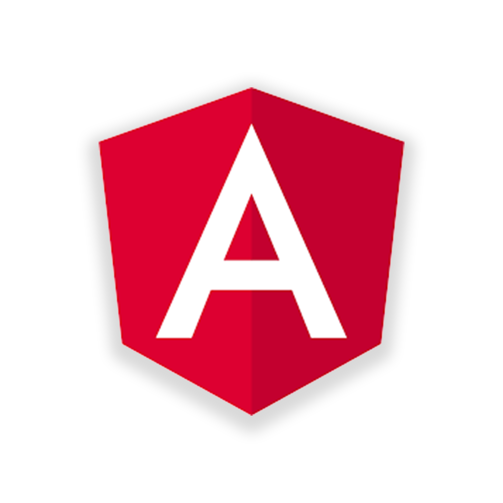
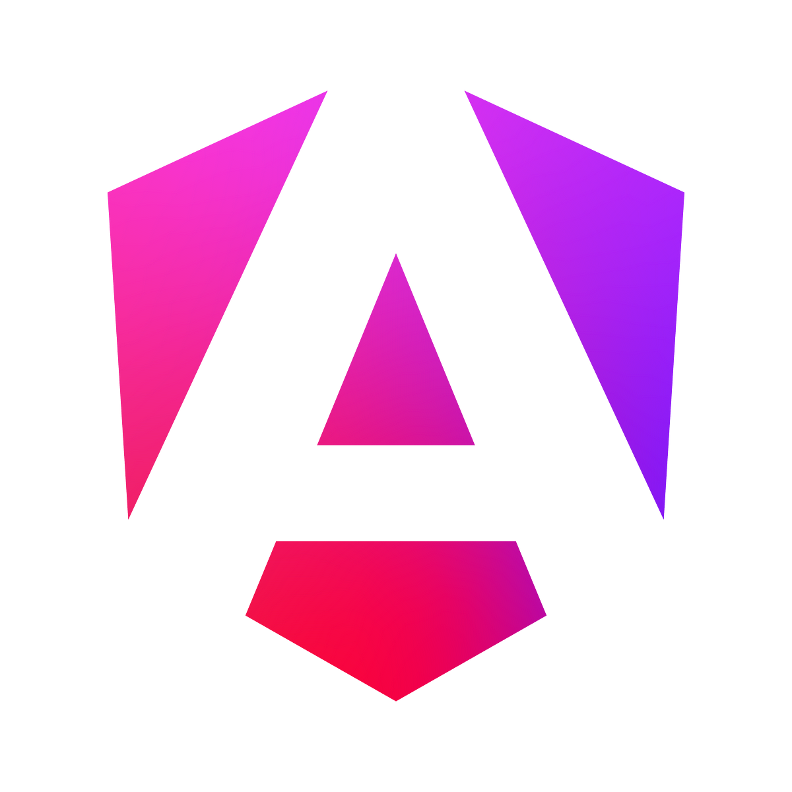
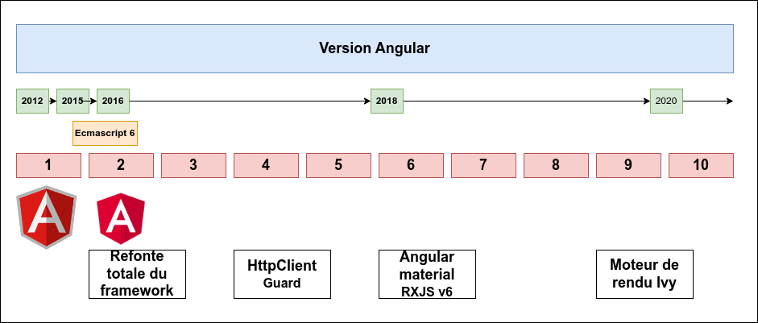
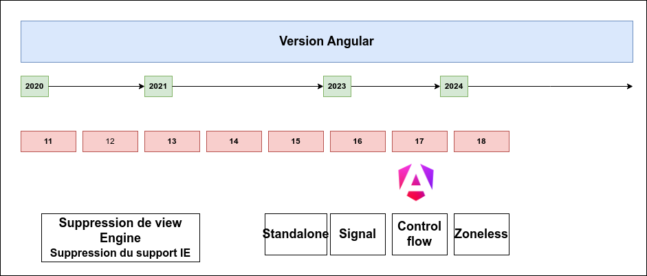
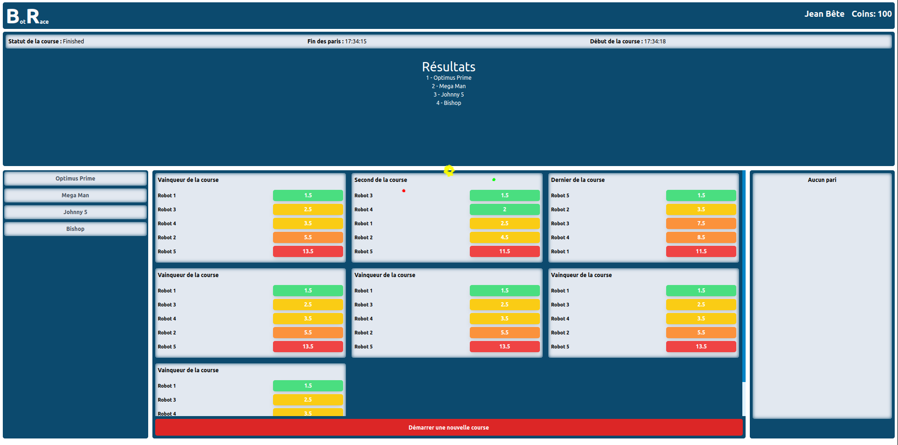

[.columns]
== Quand Angular change de logo

[.column.is-one-third]
image::images/intro/angular/logo_angular_js.png[]
[.column.is-one-third]

[.column.is-one-third]

[NOTE.speaker]
--
* Petit laïus sur les logos Onepoint en lien avec le titre de la conférence
--

=== Chronologie

[NOTE.speaker]
--
* Présentation des 10 premières versions d'Angular
* Prendre un peu de temps pour présenter le breaking change de 2015, Ecmascript 6 et la refonte d'Angular vers sa version 2.
* RXJS est arrivé directement en version 5 et il est devenu un élément central de l'écosystème Angular sur la version 6.
--

=== Chronologie

[NOTE.speaker]
--
* Changement de gouvernance côté Angular
* Sollicitation de la communauté pour les versions ou les nouveautés proposées
* RFC sur Signal a marqué un tournant dans le framework
--

=== Philosophie du Framework

- **Retrocompatible** : Depuis Angular 2, les versions sont rétrocompatibles
- **Complet** : Angular propose un ensemble complet d'outils pour le développement de votre projet, l'utilisation de ces outils fait que les projets Angular sont souvent similaires.
- **Verbeux** : Angular est verbeux, oups... expressif
- **Modulaire** : Angular peut être fragmenter en composant réutilisable (Angular lib par exemple) ou petit module.
- **Performant** : Angular est construit pour être performant

=== Documentation

----
https://angular.dev/
----

[NOTE.speaker]
--
* Rappel que la documentation est en working progress aussi. Des éléments peuvent être manquants ou incomplets.
--

=== Présentation de RaceBot

[NOTE.speaker]
--
* Présentation de BotRace, un projet de démonstration pour illustrer les concepts d'Angular
--
