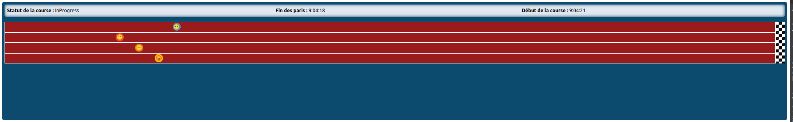
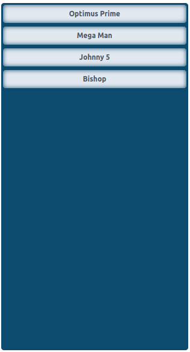
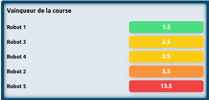
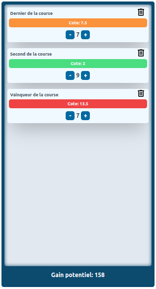

[.columns]
== Quand Angular change de logo

[.column.is-one-third]
image::images/intro/angular/logo_angular_js.png[]
[.column.is-one-third]
image::images/intro/angular/logo_angular.png[]
[.column.is-one-third]
image::images/common/logo_angular_17.png[]

[NOTE.speaker]
--
* Petit laïus sur les logos Onepoint en lien avec le titre de la conférence
--

=== Chronologie

image::images/intro/angular/chronologie-angular1.png[]

[NOTE.speaker]
--
* Présentation des 10 premières versions d'Angular
* Prendre un peu de temps pour présenter le breaking change de 2015, Ecmascript 6 et la refonte d'Angular vers sa version 2.
* RXJS est arrivé directement en version 5 et il est devenu un élément central de l'écosystème Angular sur la version 6.
--

=== Chronologie

image::images/intro/angular/chronologie-angular2.png[]

[NOTE.speaker]
--
* Changement de gouvernance côté Angular
* Sollicitation de la communauté pour les versions ou les nouveautés proposées
* RFC sur Signal a marqué un tournant dans le framework
--

=== Philosophie du Framework

- **Retrocompatible** : Depuis Angular 2, les versions sont rétrocompatibles
- **Structuré** : Angular impose une structure pour faciliter la maintenance
- **Verbeux** : Angular est verbeux, oups... expressif
- **Modulaire** : Angular est construit autour des modules
- **Performant** : Angular est performant, mais il faut respecter les bonnes pratiques

[NOTE.speaker]
--
* "A compléter", je pense qu'il est nécessaire de rappeler les principes du framework pour bien comprendre les choix de l'équipe de développement

--

=== Présentation de RaceBot

image::images/intro/bot-race/bot-race.png[]

[NOTE.speaker]
--
* Présentation de BotRace, un projet de démonstration pour illustrer les concepts d'Angular
--

=== Race

[NOTE.speaker]
--
* Présentation de la race, un ensemble de coureurs qui vont s'affronter
--

=== Liste des coureurs

[NOTE.speaker]
--
* Présentation des coureurs, un ensemble de robots qui vont s'affronter
--

=== Liste des paris possibles

[NOTE.speaker]
--
* Présentation des paris possibles, un ensemble de paris que l'on peut effectuer
--

=== Liste des paris effectués

[NOTE.speaker]
--
* Présentation des paris effectués, un ensemble de paris que l'on a effectué
* Nous avons lié les paris effectués à la course et rendu réactif l'interface
--
