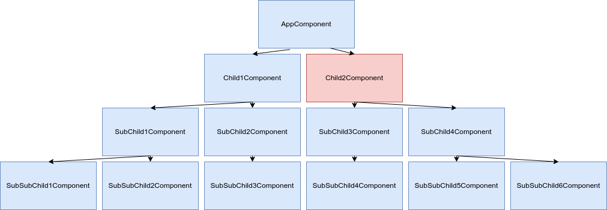
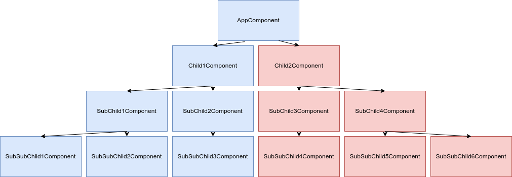
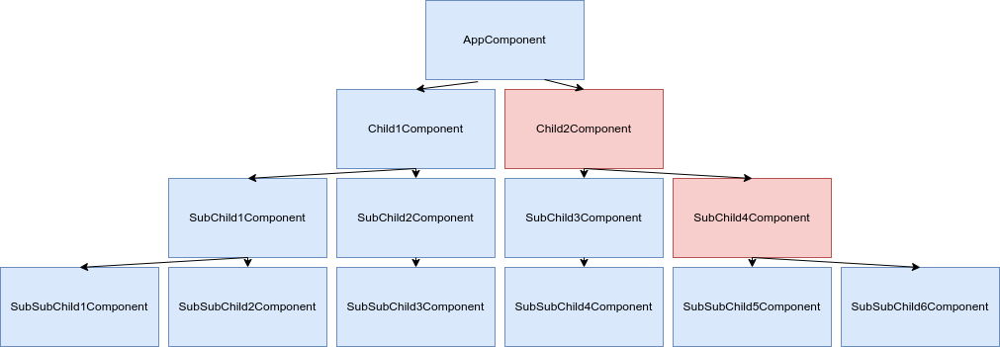

== Signal

[.notes]
****
Signal est arrivé avec Angular 16 suite à la RFC https://github.com/angular/angular/discussions/49685.
****

=== Detection de changement avant Signal

=== !

ZoneJs est utilisé pour la détection de changement.

=== !

=== !

=== Detection de changement avec Signal

=== !

Un signal est modifié, il va émettre qu'auprès des composants qui consomment ce signal.

=== !

=== !

=== C'est quoi un signal ?

=== !

Deux Types de Signaux

* Writable
* Read-only

[%auto-animate]
=== Signal Writable

[%auto-animate]
=== Signal Writable

* Signal

=== !

[source,typescript, highlight="7"]
----
@Component({
  selector: 'app-root',
  standalone: true,
  templateUrl: './app.component.html',
})
export class AppComponent {
  count: WritableSignal<number> = signal(0);
}
----

=== !

[source,html,linenums]
----

{{count()}}

----

[%auto-animate]
=== Signaux Read-only

[%auto-animate]
=== Signaux Read-only

* Computed
* Effect

[%auto-animate]
=== Computed

=== !

[source,typescript,linenums, data-id=computed, highlight="8|9..10"]
----
...
@Component({
  selector: 'app-root',
  standalone: true,
  templateUrl: './app.component.html',
})
export class AppComponent {
  count: WritableSignal<number> = signal(0);
  doubleCount: Signal<number> = computed(() =>
        this.count() * 2);
}
----

=== !

[source,html,linenums]
----

{{doubleCount()}}

----

[%auto-animate]
=== Effect

[%auto-animate]
=== !

[source,typescript, highlight="7|11|10..12"]
----
@Component({
  selector: 'app-root',
  standalone: true,
  templateUrl: './app.component.html',
})
export class AppComponent {
  count: WritableSignal<number> = signal(0);

  constructor() {
    effect(() => {
      console.log(this.count());
    });
  }
}
----

=== !

image::images/common/demo.png[]
