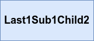

== [.title]#Signal#

=== [.sub_title]#Zone.js#

[NOTE.speaker]
--
* Détection de changement avec un exemple simple.
* Aborder le concept de zone et de propagation.
--

=== !

--
[.arbo]
image::images/signal/app.png[]

--

[%step]
--
[.arbo-2-1]

[.arbo-2-2]

--

[%step]
--
[.arbo-3-1]
image::images/signal/sub1child1.png[]

[.arbo-3-2]
image::images/signal/sub2child1.png[]

[.arbo-3-3]

[.arbo-3-4]
image::images/signal/sub2child2.png[]
--

[%step]
--
[.arbo-4-1]
image::images/signal/last1sub1child1.png[]

[.arbo-4-2]
image::images/signal/last2sub1child1.png[]

[.arbo-4-3]
image::images/signal/last1sub2child1.png[]

[.arbo-4-4]

[.arbo-4-5]

[.arbo-4-6]
image::images/signal/last2sub2child2.png[]
--

[%step]
--
[.arbo-2-2]
image::images/signal/child2a.png[]
--

[%step]
--
[.arbo-3-4]

--

[%step]
--
[.arbo-3-3]
image::images/signal/sub1child2a.png[]
[.arbo-3-4]
image::images/signal/sub2child2a.png[]
--

[%step]
--
[.arbo-4-4]
image::images/signal/last1sub1child2a.png[]
[.arbo-4-5]
image::images/signal/last1sub2child2a.png[]
[.arbo-4-6]
image::images/signal/last1sub2child2a.png[]
--

[NOTE.speaker]
--
* Exemple simple d'un événement déclencher sur le composant child2.
* Il n'y a qu'un seul impact sur le composant subChild2.
--

=== [.sub_title]#Signal#

=== !

--
[.arbo]
image::images/signal/app.png[]

[.arbo-2-1]

[.arbo-2-2]

[.arbo-3-1]
image::images/signal/sub1child1.png[]

[.arbo-3-2]
image::images/signal/sub2child1.png[]

[.arbo-3-3]

[.arbo-3-4]
image::images/signal/sub2child2.png[]

[.arbo-4-1]
image::images/signal/last1sub1child1.png[]

[.arbo-4-2]
image::images/signal/last2sub1child1.png[]

[.arbo-4-3]
image::images/signal/last1sub2child1.png[]

[.arbo-4-4]

[.arbo-4-5]

[.arbo-4-6]
image::images/signal/last2sub2child2.png[]
--

[%step]
--
[.arbo-2-2]
image::images/signal/child2a.png[]
--

[%step]
--
[.arbo-3-4]

--

[%step]
--
[.arbo-3-4]
image::images/signal/sub2child2a.png[]
--

=== [.sub_title]#Writable Signal#

=== !

[source,typescript, highlight="7|3"]
----
@Component({
  template: `
    
{{count()}}

  `,
})
export class WritableSignalComponent {
  count: WritableSignal<number> = signal(0);
}
----

=== [.sub_title]#Signaux Read-only#

[%auto-animate]
=== [.sub_title]#Computed#

[source,typescript,linenums, data-id=computed, highlight="8|9..11|4"]
----
...
@Component({
  template: `
    
{{doubleCount()}}

  `,
})
export class AppComponent {
  count: WritableSignal<number> = signal(0);
  doubleCount: Signal<number> = computed(() => {
    return this.count() * 2
  });
}
----

[NOTE.speaker]
--
* Le computed est un signal qui dépend d'un autre signal.
--

[%auto-animate]
=== [.sub_title]#Effect#

[source,typescript, highlight="5|8..10"]
----
@Component({
  template: ``,
})
export class AppComponent {
  count: WritableSignal<number> = signal(0);

  constructor() {
    effect(() => {
      console.log(this.count());
    });
  }
}
----

[%auto-animate]
=== [.sub_title]#Preview Time#

image::images/signal/slalom.gif[]

[%auto-animate]
=== [.sub_title]#Bindings#

[source,typescript,data-id=component, highlight="..|2|3,5"]
----
export class InputChildComponent {
  disabled = input(false);
  checked = model(false);
  toggle() {
    this.checked.set(!this.checked());
  }
}
----

[source,html,hightlight]
----
<app-input-child [disabled]="disabled()"
                 [(checked)]="checked"></app-input-child>
----

[%auto-animate]
=== [.sub_title]#View & content queries#

[source,typescript,data-id=component, highlight="..|4,9|5,10"]
----
@Component({
  imports: [RouterLink],
  template: `
    

    <ng-content></ng-content>
  `
})
export class QueriesExampleComponent {
  map = viewChild.required('map', { read: ElementRef });
  links = contentChildren(RouterLink, { descendants: true });
}
----

[%auto-animate]
=== [.sub_title]#RxJS Interop#

[%auto-animate]
=== [.sub_title]#RxJS Interop#

[source,typescript,data-id=component, highlight="1|3"]
----
const users = Signal<User[]> = toSignal(users$);

const todoList$: Observable<Task[]> = toObservable(todoList);
----

=== !

