== [.title]#Standalone#

=== !
--
[.module]
image::images/standalone/module.png[]
--
[%step]
--
[.declarations]
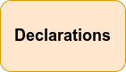
--

[%step]
--
[.exports]
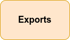
--

[%step]
--
[.imports]
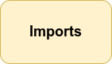
--

[%step]
--
[.providers]
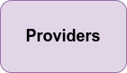
--

[%step]
--
[.schemas]
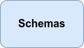
--

[%step]
--
[.autres]
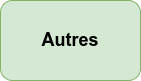
--

[%step]
--
[.component]
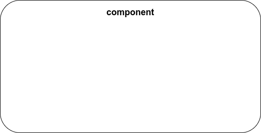
--

[%step]
--
[.selector]
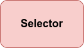
--

[%step]
--
[.templateUrls]
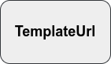
--

[%step]
--
[.styleUrls]
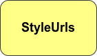
--

[%step]
--
[.changeDetection]

--

[%step]
--
[.encapsulation]
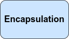
--

[%step]
--
[.autres-component]

--

=== !

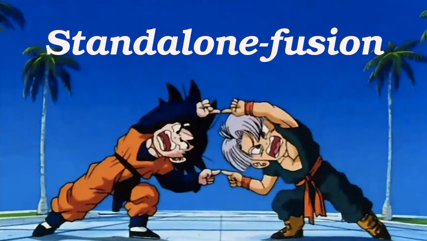

=== !

--
[.module]
image::images/standalone/module.png[]
--
--
[.declarations]

--
--
[.exports]

--
--
[.imports]

--
--
[.providers]

--
--
[.schemas]

--
--
[.autres]

--
--
[.component]

--
--
[.selector]

--
--
[.templateUrls]

--
--
[.styleUrls]

--
--
[.changeDetection]

--
--
[.encapsulation]

--
--
[.autres-component]

--
[%step]
--
[.standalone]
image::images/standalone/standalone.png[]
--

[%step]
--
[.standalone-standalone]
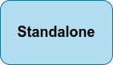
--

[%step]
--
[.declarations]

[.exports]

--

[%step]
--
[.imports]

[.imports-standalone]

--

[%step]
--
[.schemas]

[.schemas-standalone]

--

[%step]
--
[.providers]

[.providers-standalone]

--

[%step]
--
[.autres]

--

[%step]
--
[.selector]

[.selector-standalone]

--

[%step]
--
[.templateUrls]

[.templateUrls-standalone]

--

[%step]
--
[.styleUrls]

[.styleUrls-standalone]

--

[%step]
--
[.changeDetection]

[.changeDetection-standalone]

--

[%step]
--
[.encapsulation]

[.encapsulation-standalone]

--

[%step]
--
[.autres-component]

[.autres-standalone]

--

=== !

[source,javascript,highlight="1|2|3|4|5"]
----
@Component({
  selector: 'layout-root',
  standalone: true,
  imports: [CommonModule, TestComponent],
  templateUrl: './layout.component.html',

})
export class LayoutComponent {}
----

[NOTE.speaker]
--
* Présentation de composant Standalone.
* Reprise de l'ensemble des fonctionnalités.
* Préparation d'une nouvelle façon d'importer les composants.
--

=== [.sub_title]#Bootstrap Angular#

[%step]
--
[.bootstrap-module]
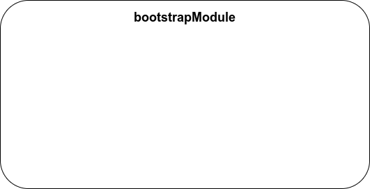
--

[%step]
--
[.app-module]
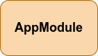
--

[%step]
--
[.bootstrap-application]
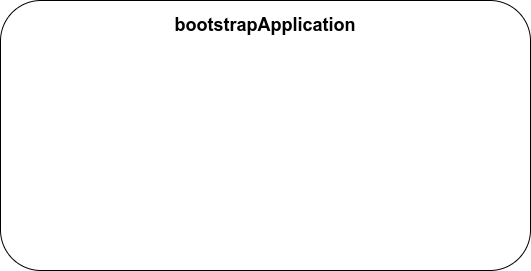
--

[%step]
--
[.app-component]
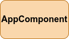
--

[%step]
--
[.app-config]
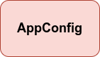
--

=== !

[source,javascript,highlight="1|2,5|3|4"]
----
export const appConfig: ApplicationConfig = {
  providers: [
    provideRouter(routes),
    provideHttpClient()
  ]
};
----

=== [.sub_title]#Schematic Standalone#

[%step]
--
[.text]
ng generate @angular/core:standalone
--

=== [.sub_title]#Tout se migre automatiquement ?#

[.control-flow-demo-image]
image::images/common/demo.png[]
