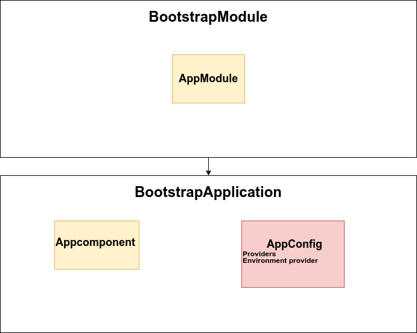

== [.title]#Standalone#

=== !
--
[.module]
image::images/standalone/component.png[]
--

[%step]
--
[.component]
image::images/standalone/component.png[]
--

=== !
image::images/standalone/fusion.png[]

=== !

--
[.module]
image::images/standalone/component.png[]
--

--
[.component]
image::images/standalone/component.png[]
--
[%step]
--
[.standalone]
image::images/standalone/component.png[]
--

=== !

[source,javascript,highlight="1|2|3|4|5"]
----
@Component({
  selector: 'layout-root',
  standalone: true,
  imports: [CommonModule, TestComponent],
  templateUrl: './layout.component.html',

})
export class LayoutComponent {}
----

[NOTE.speaker]
--
* Présentation de composant Standalone.
* Reprise de l'ensemble des fonctionnalités.
* Préparation d'une nouvelle façon d'importer les composants.
--

=== Bootstrap Angular

[NOTE.speaker]
--
* Définition du bootstraping d'angular.
* Présentation de la méthode des nouveaux providers environment.
--

=== Schematic Standalone

[script]
--
ng generate @angular/core:standalone
--

[NOTE.speaker]
--
* Présentation de la schématics et précisant que ça ne fait pas tout.
--

=== !

image::images/common/demo.png[]
