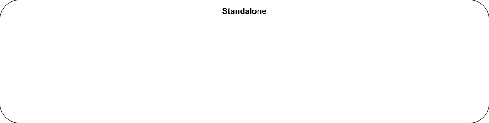

== Standalone

=== Module

image::images/standalone/module.png[]

=== !
[source,javascript,highlight="1|2|3..5|6..11|12"]
----
@NgModule({
    declarations: [LayoutComponent],
    imports: [
        CommonModule
    ],
    providers: [
        TestService,
        { provide: Test2Service,
          useClass: OverTest2Service
        }
    ],
    exports: [LayoutComponent]
})
export class LayoutModule {}
----

=== Standalone

=== !

[source,javascript,highlight="1|2|3|4|5|9"]
----
@Component({
  selector: 'layout-root',
  standalone: true,
  imports: [CommonModule],
  templateUrl: './layout.component.html',

})
export class LayoutComponent {
    testService = inject(TestService);
}
----

=== Schematic Standalone

[script]
--
ng generate @angular/core:standalone
--

=== !

image::images/common/demo.png[]
