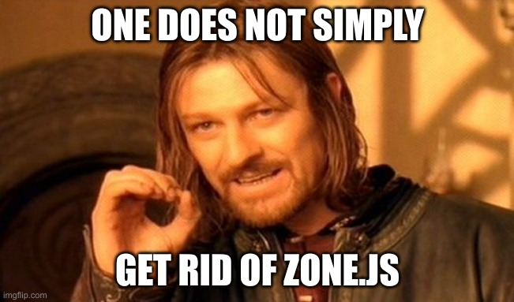

== [.title]#Des applications _Zoneless_#

[NOTE.speaker]
--
* De gros effort vers le mode zoneless
* Mais la route est encore longue
--

=== [.sub_title]#Planification ng18+#

[%step.list]
* Signal
* PipeAsync
* ViewContainer
* input
* markForCheck

[NOTE.speaker]
--
* L'idée est de planifier les détections de changement avec les primitives du framework plutôt que de s'appuyer sur une lib externe
* C'est encore expérimental mais cela permet de tracer un chemin vers le mode zoneless
* Supporté actuellement en v18 et fonctionne bien en mode zoneless (ex notre application)
* source: https://github.com/angular/angular/blob/67b2c336bc0bdce3f7ae054c094990a9831f5b20/packages/core/src/change_detection/scheduling/zoneless_scheduling_impl.ts#L295
--

=== [.sub_title]#Experimental Zoneless#

Il est possible de tester nos application en Zoneless en v18

[source,typescript]
----
export const appConfig: ApplicationConfig = {
  providers: [
    // ...
    provideExperimentalZonelessChangeDetection()
  ]
};
----

[NOTE.speaker]
--
* TODO config + démo
* Un branche à part pour sauter d'une conf à l'autre + affichage dans le profiler de ngDebugTools ?
--

=== [.sub_title]#Mode hybride ?#

[%step]
--
Par défaut Angular écoute tout

Zone.js &#x1F91D; Signal
--

[NOTE.speaker]
--
* Actuellement par défault à partir de Angular 18 les applications supporte l'ensemble des mécanismes (zone et zoneless)
* TODO demo ?
--

=== [.sub_title]#Un chemin vers Zoneless#

[%step]
--
Planifier dès maintenant
--

[%step]
--
⚠️ Attention à ce qui est encore en _developer preview_
--

[NOTE.speaker]
--
* Actuellement par défault à partir de Angular 18 les applications supporte l'ensemble des mécanismes (zone et zoneless)
* Ceci offre une opportunité de transition entre les deux modèle applicatif et de mettre en place une stratégie de migration progressive vers signal et un mode zoneless
--
